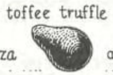
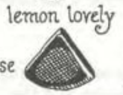
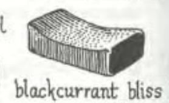
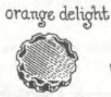

n | Shape | Item | Picture
--- | --- | --- | ---
1 | pyramid-shaped | brazilnut bonanza | 
2 | spherical | lime limousine | 
3 | a perfect cube | caramel castle | 
4 | crescent-shaped | coffee cream | 
5 | a spiral | nougat novelty | 
6 | pear-shaped | toffee truffle | 
7 | conical, a cone | lemon lovely | 
8 | oblong, with a convex top | | 
9 | rectangular, with a concave top | blackcurrant bliss | 
10 | round, with a serrated edge | orange delight | 
11 | semi-circular, half-moon shaped | almond attraction | 
12 | square, with an uneven surface | marzipan marvel | 
13 | cylindrical, log-shaped | hazelnut hat | 
14 | triangular, three-sided | tangerine treat | 

# Non regular shape

name | Picture
--- | ---
peppermint pearl | 
  
